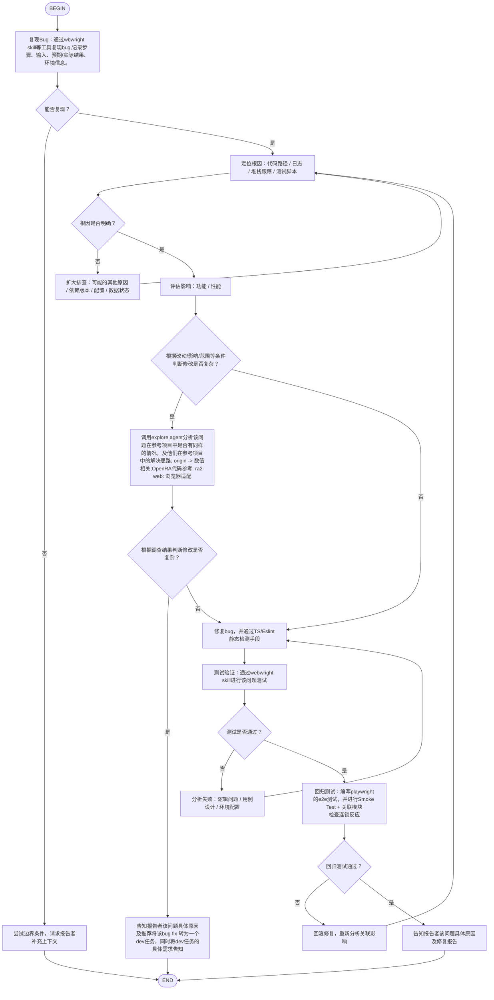

```mermaid
flowchart TD
    A([BEGIN]) --> B[复现Bug：通过wbwright skill等工具复现bug,记录步骤、输入、预期/实际结果、环境信息。]
    B --> C{能否复现？}
    C -->|否| D[尝试边界条件，请求报告者补充上下文]
    D --> U([END])
    C -->|是| E[定位根因：代码路径 / 日志 / 堆栈跟踪 / 测试脚本]
    E --> F{根因是否明确？}
    F -->|否| G[扩大排查：可能的其他原因 / 依赖版本 / 配置 / 数据状态]
    G --> E
    F -->|是| H[评估影响：功能 / 性能]
    H --> I{根据改动/影响/范围等条件判断修改是否复杂？}
    I --> |是| V[调用explore agent分析该问题在参考项目中是否有同样的情况，及他们在参考项目中的解决思路; origin -> 数值相关;OpenRA代码参考: ra2-web: 浏览器适配]
    V --> L{根据调查结果判断修改是否复杂？}
    L --> |是| J[告知报告者该问题具体原因及推荐将该bug fix 转为一个dev任务，同时将dev任务的具体需求告知]
    L --> |否| K
    J --> U([END])
    I -->|否| K[修复bug，并通过TS/Eslint静态检测手段]
    K --> N[测试验证：通过webwright skill进行该问题测试]
    N --> O{测试是否通过？}
    O -->|否| P[分析失败：逻辑问题 / 用例设计 / 环境配置]
    P --> K
    O -->|是| Q[回归测试：编写playwright的e2e测试，并进行Smoke Test + 关联模块<br/>检查连锁反应]
    Q --> R{回归测试通过？}
    R -->|否| S[回滚修复，重新分析关联影响]
    S --> E
    R -->|是| T[告知报告者该问题具体原因及修复报告]
    T --> U([END])
```