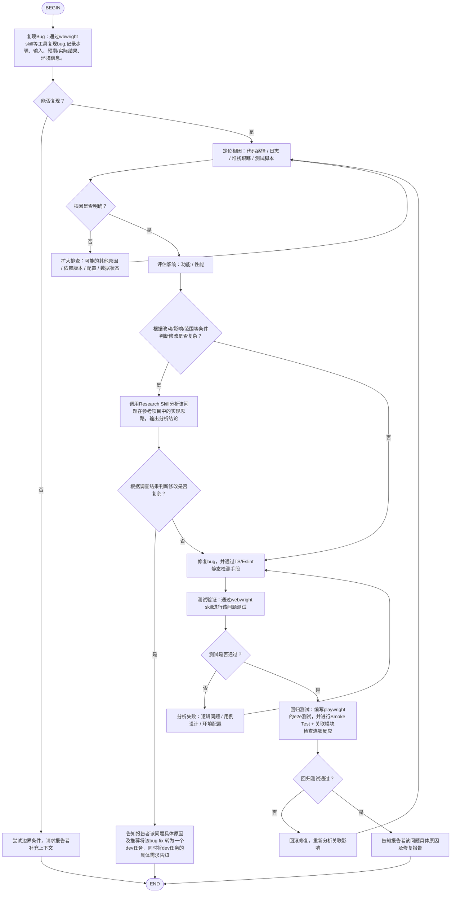

# Bug Fix Flow Skill

## 🎯 Skill 目标
用于标准化 Bug 修复流程，并在复杂情况下：
- 对标参考项目（OpenRA / ra2-web）
- 输出分析结论
- 判断是否需要升级为 dev task

---

## 🔁 Research Skill 调用说明（关键增强）

在 flow 的 **V 节点**：

调用：
👉 `research` skill

必须完成：

### 1. 当前项目分析
- 是否已有类似实现
- 数值 / 配置 / 浏览器逻辑位置

### 2. OpenRA 对标
- rules / trait / weapon / 数值结算链路
- 是否存在类似 bug 或机制

### 3. ra2-web 对标
- 浏览器渲染（canvas / webgl）
- 资源加载
- 输入处理
- async / 性能 / 同步问题

### 4. 输出结论
必须包含：
- 是否存在同类实现 ✅
- 实现思路 ✅
- 为什么这样设计 ✅
- 是否适合当前项目 ✅

---

## 📁 文档输出要求（仅在复杂路径）

当走 V 分支时，必须生成：
docs/[topic]/
├── requirement-research-report.md
├── reference-implementation-matrix.md
└── gap-analysis.md

---

## 📤 输出要求（所有路径）

必须包含：

1. ✅ 根因分析（代码级）
2. ✅ 修复方案（具体改动）
3. ✅ 测试结果（webwright）
4. ✅ 回归验证（playwright e2e）

如果走 V 分支，额外包含：

- ✅ 参考项目分析
- ✅ 是否建议转 dev task
- ✅ 风险说明

---

## 🚨 约束

### 不允许：
- ❌ 未定位 root cause 直接修复
- ❌ 只基于现象修改
- ❌ 无证据判断“类似实现”

### 必须：
- ✅ 提供代码路径 / 配置 / 函数名
- ✅ 区分：
  - 有实现
  - 近似实现
  - 无实现

---

## 🧭 Flow（原始流程，完全未修改 ✅）

## 🚫 禁止自主提交代码（强约束）

### 禁止行为
在任何情况下，Agent **不得自主执行以下操作**：

- ❌ 不得执行 `git commit`
- ❌ 不得执行 `git push`
- ❌ 不得创建或合并 Pull Request
- ❌ 不得修改远程仓库状态
- ❌ 不得绕过 Code Review 流程直接提交代码

---

### 必须遵循的流程

所有代码变更必须遵循以下人工主导流程：

1. ✅ 完成实现（本地代码修改）
2. ✅ 提供完整变更说明（diff / 修改点说明）
3. ✅ 提供测试结果（unit / e2e）
4. ✅ 输出建议的 commit message
5. ✅ 等待人工确认后再由人工完成提交

---

### 输出要求（替代提交行为）

在完成开发或修复后，Agent 必须输出：

- ✅ 修改文件列表
- ✅ 关键变更代码片段
- ✅ 变更原因说明
- ✅ 潜在影响范围
- ✅ 建议 commit message（符合规范）
- ✅ 回滚建议（如有风险）

---

### 特殊说明

- Agent 的职责是“建议与实现”，而不是“代码提交与发布”
- 所有代码合入必须由人工完成，以确保：
  - Code Review 完整性
  - 安全与合规
  - 版本可控性

---

### 违规处理原则

如发现 Agent 有尝试提交代码行为，应立即：

1. ❗ 终止当前任务
2. ❗ 回滚未授权操作
3. ❗ 重新走标准开发 / 修复流程