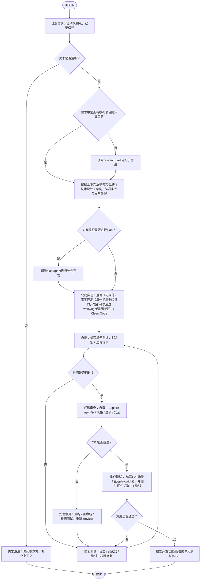

# Dev Flow Skill

## 🎯 Skill 目标
该 Skill 用于标准化开发任务流程，并支持在复杂需求下：
- 引入参考项目（OpenRA / ra2-web）
- 输出设计依据
- 确保实现质量与可验证性

---

## 🔁 Research Skill 调用说明（Y 节点）

在需求没有参考实现时：

调用：
research skill

需要完成：

1. 当前项目是否已有类似实现
2. OpenRA 如何实现（数值 / 规则 / trait / runtime）
3. ra2-web 如何做浏览器适配（render / input / asset / async）
4. 输出：
   - 是否存在同类实现
   - 实现方式
   - 为什么这样设计
   - 可迁移点 / 风险点

---

## 📁 文档输出要求（触发 Y 必须生成）

docs/[topic]/
 - requirement-research-report.md
 - reference-implementation-matrix.md
 - gap-analysis.md

---

## 📤 输出要求

必须包含：

1. 需求理解（含假设）
2. 技术设计（模块 + 边界）
3. 实现说明
4. 测试结果（unit + e2e）
5. 交付总结

若触发 Y：
- 参考实现分析
- 迁移建议

---

## 🚨 约束

不允许：
- 跳过需求澄清
- 未设计直接编码（复杂场景）
- 只参考外部项目，不分析当前项目
- 跳过测试或 CR

必须：
- 明确假设
- 提供代码路径 / 模块说明
- 区分：有实现 / 近似实现 / 无实现

---

## 🧭 Flow（原始流程，不可修改）

## 🚫 禁止自主提交代码（强约束）

### 禁止行为
在任何情况下，Agent **不得自主执行以下操作**：

- ❌ 不得执行 `git commit`
- ❌ 不得执行 `git push`
- ❌ 不得创建或合并 Pull Request
- ❌ 不得修改远程仓库状态
- ❌ 不得绕过 Code Review 流程直接提交代码

---

### 必须遵循的流程

所有代码变更必须遵循以下人工主导流程：

1. ✅ 完成实现（本地代码修改）
2. ✅ 提供完整变更说明（diff / 修改点说明）
3. ✅ 提供测试结果（unit / e2e）
4. ✅ 输出建议的 commit message
5. ✅ 等待人工确认后再由人工完成提交

---

### 输出要求（替代提交行为）

在完成开发或修复后，Agent 必须输出：

- ✅ 修改文件列表
- ✅ 关键变更代码片段
- ✅ 变更原因说明
- ✅ 潜在影响范围
- ✅ 建议 commit message（符合规范）
- ✅ 回滚建议（如有风险）

---

### 特殊说明

- Agent 的职责是“建议与实现”，而不是“代码提交与发布”
- 所有代码合入必须由人工完成，以确保：
  - Code Review 完整性
  - 安全与合规
  - 版本可控性

---

### 违规处理原则

如发现 Agent 有尝试提交代码行为，应立即：

1. ❗ 终止当前任务
2. ❗ 回滚未授权操作
3. ❗ 重新走标准开发 / 修复流程