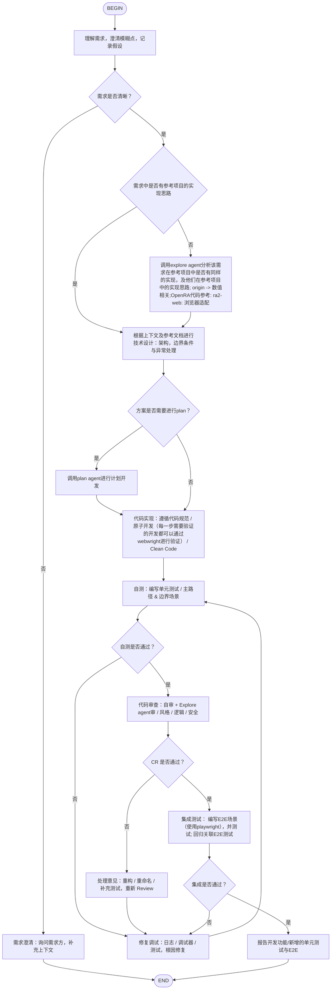

```mermaid
flowchart TD
    A([BEGIN]) --> B[理解需求，澄清模糊点，记录假设]
    B --> C{需求是否清晰？}
    C -->|否| D[需求澄清：询问需求方，补充上下文]
    D --> W([END])
    C -->|是| X{需求中是否有参考项目的实现思路}
    X -->|是| E[根据上下文及参考文档进行技术设计：架构，边界条件与异常处理]
    X -->|否| Y[调用explore agent分析该需求在参考项目中是否有同样的实现，及他们在参考项目中的实现思路; origin -> 数值相关;OpenRA代码参考: ra2-web: 浏览器适配]
    Y --> E
    E --> F{方案是否需要进行plan？}
    F -->|是| G[调用plan agent进行计划开发]
    G --> H
    F -->|否| H[代码实现：遵循代码规范 / 原子开发（每一步需要验证的开发都可以通过webwright进行验证） / Clean Code]
    H --> I[自测：编写单元测试 / 主路径 & 边界场景]
    I --> J{自测是否通过？}
    J -->|否| K[修复调试：日志 / 调试器 / 测试，根因修复]
    K --> I
    J -->|是| L[代码审查：自审 + Explore agent审 / 风格 / 逻辑 / 安全]
    L --> M{CR 是否通过？}
    M -->|否| N[处理意见：重构 / 重命名 / 补充测试，重新 Review]
    N --> K
    M -->|是| O[集成测试： 编写E2E场景（使用playwright），并测试; 回归关联E2E测试]
    O --> P{集成是否通过？}
    P -->|否| K
    P -->|是| R[报告开发功能/新增的单元测试与E2E]
    R --> W([END])
```